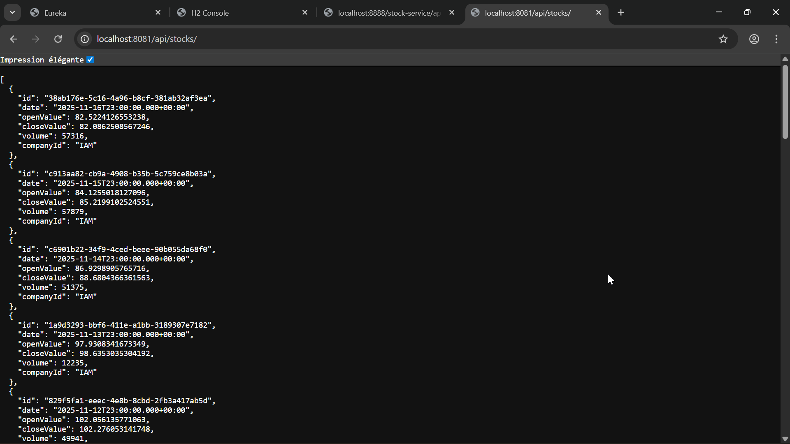
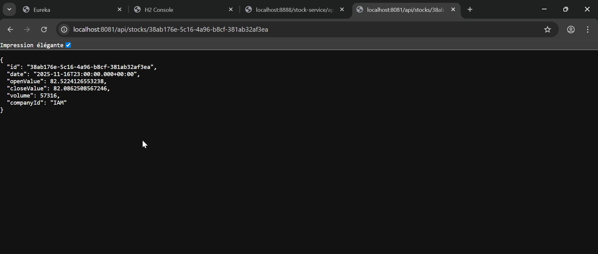
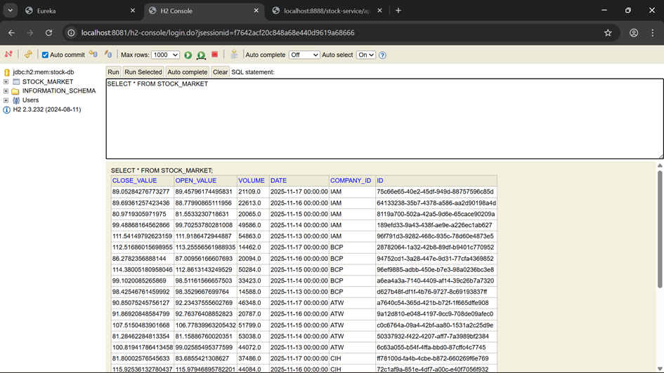
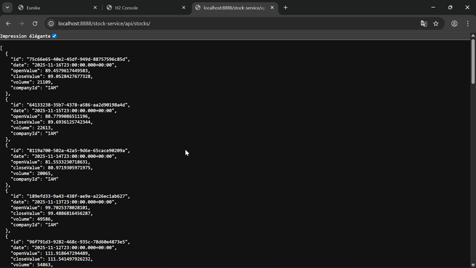
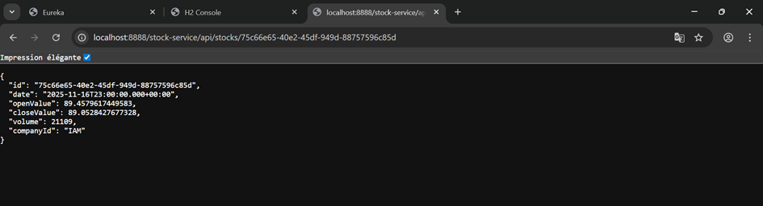
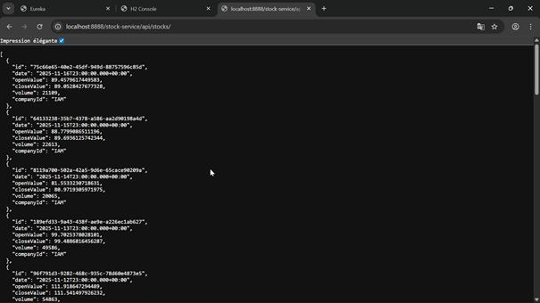

# ENSET Adria Stock Market Suite

This repository hosts a small microservices demo showing how to manage stock market data with Spring Boot (Java 21), Spring Cloud, a React frontend, and JWT-secured API Gateway routing.

## Services Overview

| Service | Port | Description |
| --- | --- | --- |
| `discovery-service` | 8761 | Netflix Eureka server for service registration & discovery. |
| `stock-service` | 8081 | CRUD API with H2 in-memory storage and seed data for Moroccan companies. |
| `auth-service` | 8090 | Simple JWT issuer validating static user credentials. |
| `gateway-service` | 8888 | Spring Cloud Gateway enforcing JWTs and routing to downstream services. |
| `frontend` | 5173 (dev) | React + Vite dashboard fetching data via the gateway. |

## Back-end Highlights

### Discovery Service
* `@EnableEurekaServer` with port 8761.
* Clients register using `eureka.client.service-url.defaultZone=http://localhost:8761/eureka`.


### Stock Service
* Exposes `/api/stocks` REST endpoints (GET list, GET by id, POST, PUT, DELETE).
* Uses `StockRepository` (Spring Data JPA) with H2.
* Seeds random data via `CommandLineRunner` for companies like IAM, BCP, ATW, CIH, ADH.
* Computes the latest “current price” per company when updating or creating entries.




### Auth Service
* `/api/auth/login` authenticates preset users (`admin/admin123`, `analyst/stocks2024`, `viewer/password`) and returns JWT + expiration.
* `/api/auth/validate` checks Authorization Bearer tokens for internal verification.
* Uses jjwt 0.11 with HS256 and shared secret (configure via `jwt.secret`).


### Gateway Service
* Spring Cloud Gateway + Eureka client.
* Route: `/stock-service/**` -> `lb://stock-service` with `StripPrefix=1`.
* Custom `JwtAuthenticationFilter` ensures every request (except `/api/auth` and `/actuator`) includes a valid token.




## Front-end (React + Vite)
* Located in `/frontend`.
* Uses `AuthContext` to store token, login form for auth-service, and `StocksTable` to display grouped quotes.
* `.env` variables:
  ```bash
  VITE_AUTH_API=http://localhost:8090
  VITE_GATEWAY_API=http://localhost:8888
  ```
* `npm run dev` launches the UI at http://localhost:5173. `npm run build` creates a production bundle in `dist/`.


## Running Locally

1. **Install JDK 21** (Temurin or similar) and ensure `JAVA_HOME` points to it. The Maven wrapper requires a JDK (not JRE).
2. Start services in order (each in its own terminal):
   ```powershell
   # Discovery
   cd discovery-service
   .\mvnw.cmd spring-boot:run

   # Auth
   cd auth-service
   .\mvnw.cmd spring-boot:run

   # Stock
   cd stock-service
   .\mvnw.cmd spring-boot:run

   # Gateway
   cd gateway-service
   .\mvnw.cmd spring-boot:run
   ```
3. Seeded data is available immediately (5 recent entries per company). Stock APIs require JWT via gateway.
4. Frontend:
   ```powershell
   cd frontend
   npm install
   npm run dev
   ```
   Open http://localhost:5173 and log in with `admin/admin123` (or other default users).

## Testing Endpoints
Use any REST client or simple PowerShell `Invoke-RestMethod`:

### Obtain JWT
```powershell
Invoke-RestMethod `
  -Uri http://localhost:8090/api/auth/login `
  -Method Post `
  -ContentType "application/json" `
  -Body '{"username":"admin","password":"admin123"}'
```

### Fetch Stocks via Gateway
```powershell
Invoke-RestMethod `
  -Uri http://localhost:8888/stock-service/api/stocks `
  -Headers @{ Authorization = "Bearer <token>" }
```


## Deployment Notes
* Each Spring Boot microservice is a standalone Maven project (with wrapper scripts).
* Ensure consistent `jwt.secret` across auth-service and gateway.
* For production, replace H2 with persistent storage and move user data to a proper database/identity provider.
* The React frontend can be hosted separately or served behind another gateway route.


